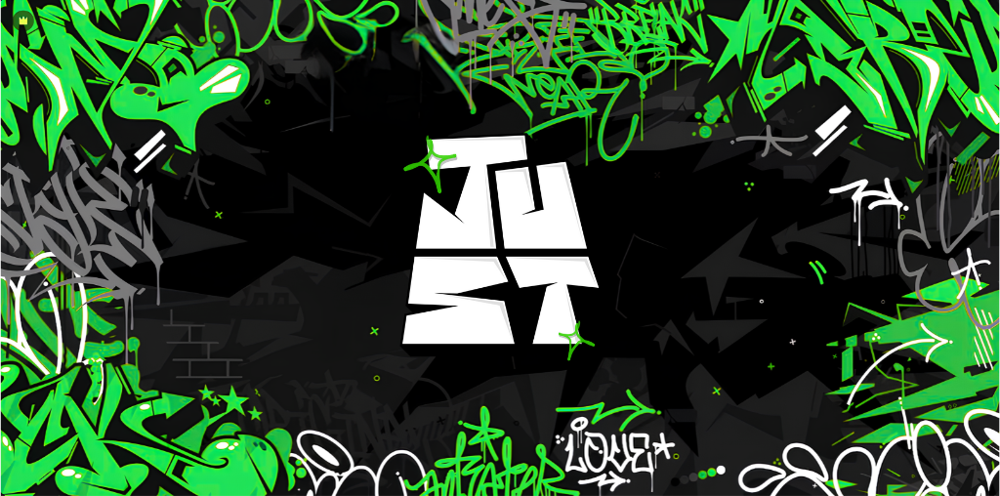

# 🚧 BANCO FLEECA (CHAVES)

Quantidade de bandidos: 7 (mínimo de 3 dentro)

Máximo de pm: 9

Máximo de veículos por parte dos bandidos caso seja na fuga: 3

Policiais: Máximo de 3 Unidade por veículos + Águia

Armamento: Smg/Fuzil

Negociação: Obrigatória

Smoke: 3 (NEGOCIÁVEL)

Refém: Opcional, no máximo&#x20;

<figure><figcaption></figcaption></figure>
